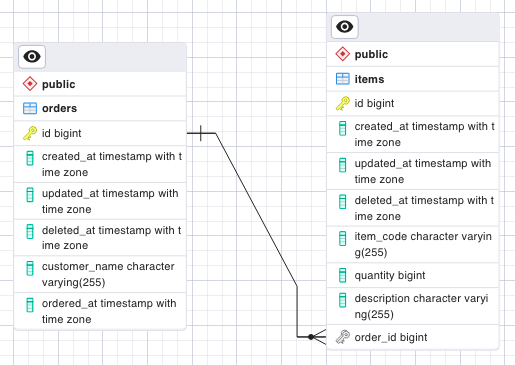
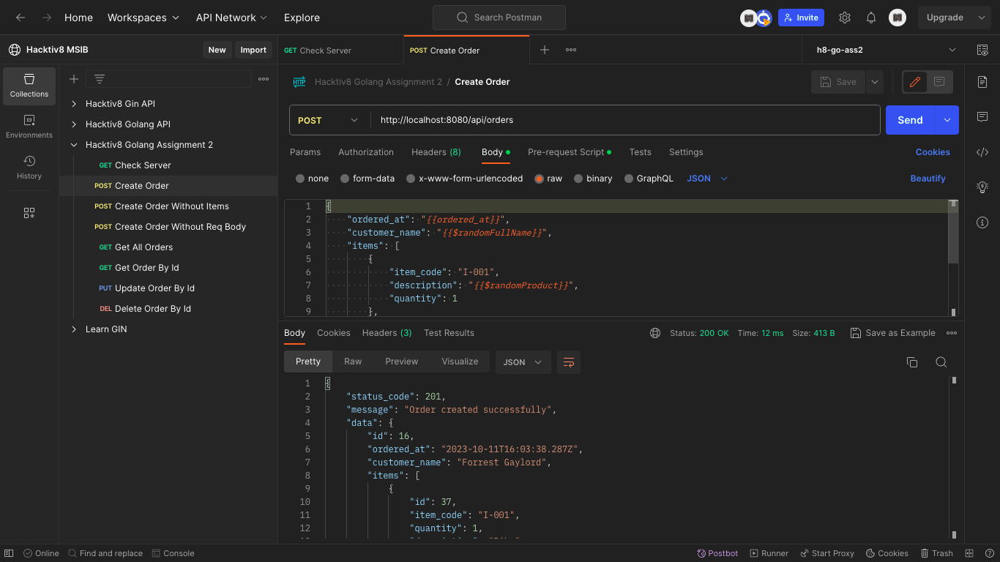
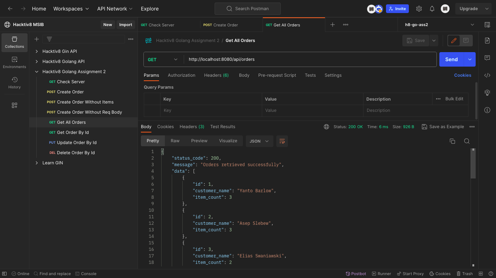
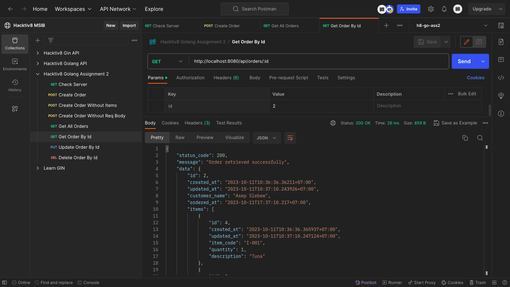
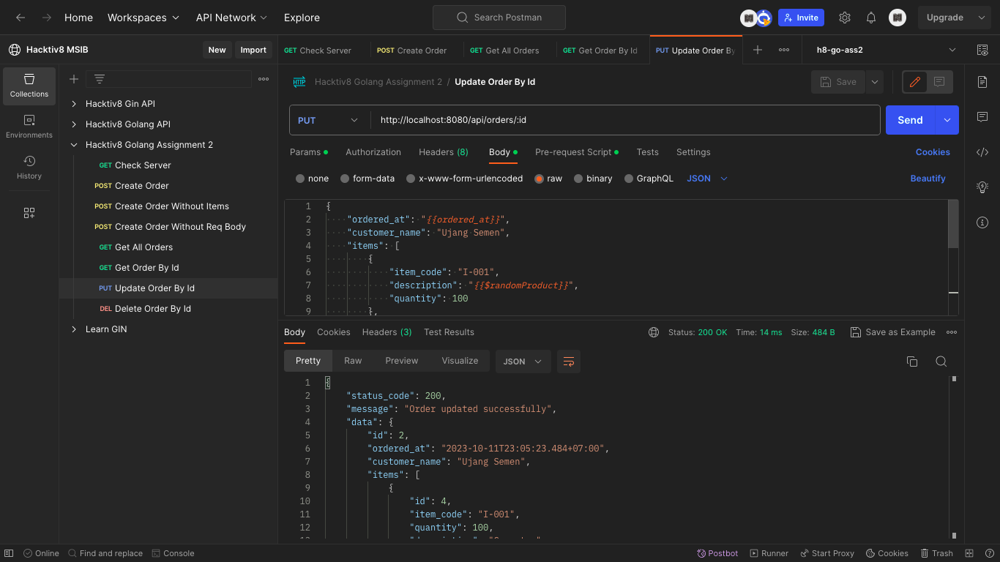
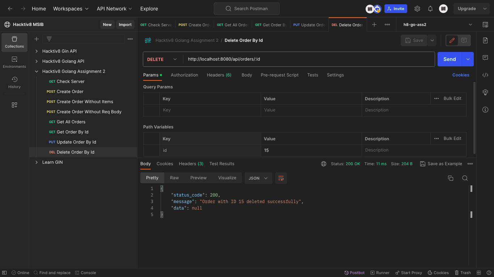
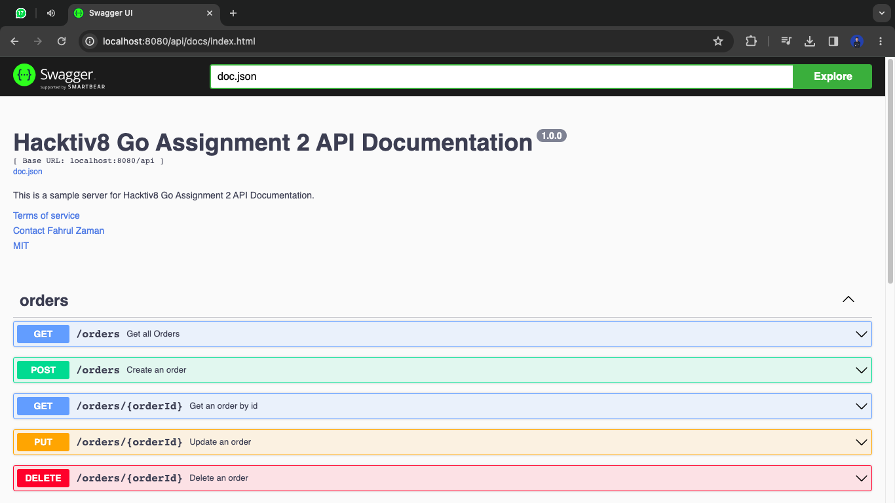

# MSIB Hacktiv8 Go Assignment 2

### Author

- ID : GLNG-KS07-06
- Nama : Fahrul Zaman
- Kelas : GLNG-KS07
- Universitas : Universitas Bale Bandung

### Notes

- [x] Order API
  - [x] Create Order
  - [x] Get All Orders
  - [x] Get Detail Order by ID
  - [x] Update Order by ID
  - [x] Delete Order by ID
- [x] Documentation with Swagger

### How to Run

1. Clone this repository and go to the directory
2. Create `.env` file and copy the content from `.env.example` file
3. Run `go mod tidy` to install dependencies
4. Run `go run main.go` to start the server
5. Open `http://localhost:8080` to see the result
6. Open `http://localhost:8080/api/docs/index.html` to see the documentation

### Instructions

Buatlah Rest API (create, update, read, delete) dari service order.
Buatlah 2 table items, dan orders dengan membuat table orders ke items menjadi relasi one to many.

### Database Schema

### Test

- Create Order
  
- Get All Orders
  
- Get Detail Order by ID
  
- Update Order by ID
  
- Delete Order by ID
  
- Documentation with Swagger
  

### Thank You

back to [top](#msib-hacktiv8-go-assignment-2)
